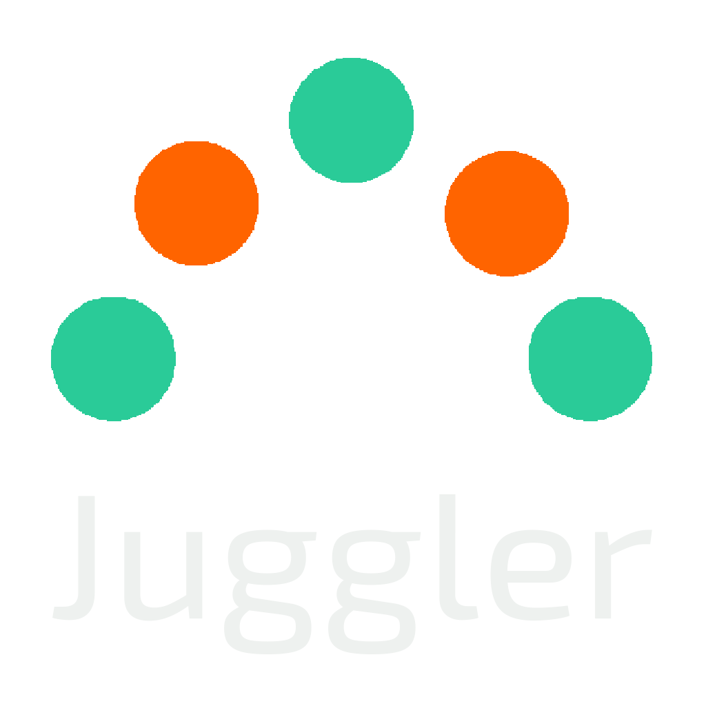

# Juggler

## Description

Juggler is a versatile task management app designed for individuals seeking a seamless blend of work and personal life organization. With a minimalist aesthetic and an emphasis on customization, Juggler offers various layout options and ten color themes, ensuring a tailored experience that suits your preferences.

Combining schedule/calendar functionalities and a task view, the app goes beyond conventional task management by providing work/life balance statistics and personalized recommendations for activities. Customize your experience with options like defining balance goals, setting sleeping hours, and selecting favorite activities for tailored suggestions.

Juggler offers a sleek, user-centric design, making it an ideal choice for those prioritizing a harmonious work-life balance.

## Table of Contents

- [Features](#features)
- [Installation](#installation)
- [Usage](#usage)
- [Credits](#credits)
- [Contribute](#contribute)
- [Future Additions](#future-additions)
- [License](#license)
- [Contact](#contact)
- [Support Us](#support-us)

## Features

- Schedule view with movable/resizable event boxes;
- Task view with rearrangeable, editable tasks;
- Customizable statistics based on user's logged events;
- Four layout options for the dashboard;
- Ten different color schemes;
- Welcome wizard, allowing for a personalized experience from day one;
- In-app event reminder notifications.

## Installation

Access the app directly through [here](<https://juggler-8f9213eba85d.herokuapp.com/>).

## Usage

Once signed up, a (skippable) welcome wizard guides the user through a number of customization options. The main dashboard has dedicated buttons for adding new events/tasks and accessing the user menu. Statistics and recommendations (if enabled) will show up as a sidebar(s) around the schedule/task list.

## Credits

- Checkboxes were created by Stephanie Eckles (<https://moderncss.dev/pure-css-custom-checkbox-style/>);
- Strikethrough effect for completed events is based on a tip by Jacob G at (<https://stackoverflow.com/questions/30352431/css-transition-not-working-with-underline>);
- Clown graphic was created by Peter Selinger (<https://svgsilh.com/image/160165.html>);
- Fireworks graphic was created by Gerald G (<https://openclipart.org/detail/8585/fireworks>);
- Loading pinner was created through (<https://loading.io/>);
- Burger menu graphic was created by Salah Elimam (<https://www.svgrepo.com/vectors/burger-menu/>).

Additionally, a large part of the research for this project was done through the websites Stack Overflow (<https://stackoverflow.com/>), W3 Schools (<https://www.w3schools.com/>) and ChatGPT (<https://chat.openai.com/>), and as such sections of code may have been adapted from examples and suggestions offered in those sites.

## Contribute

Feel free to fork this repository, check out the [current issues page](<https://github.com/chris-godinho/juggler/issues>) or contact me to request/suggest new features.

## Future Additions

- PWA support;
- Week/Month schedule view options;
- Repeatable events;
- 15-minute (or less!) duration events;
- Option to make events all-day by dragging them over the all-day area;
- Autocomplete events/tasks after their assigned end times;
- Support for changing timezones/date and time display format;
- Reminder e-mail notifications;
- Personalized (AI-generated) default profile pictures;
- Customizable colours for event categories;
- Layout change toggles on dashboard;
- Quality of Life/Productivity tips.

## License

This project is licensed under the [MIT](/LICENSE) License.

## Contact

This project was created by [Chris Godinho](<http://chrisgodinho.com/>).

## Support Us

If you enjoy Juggler and its functionalities, please consider making a donation [here](<https://donate.stripe.com/8wM3dFa433Urdva6oo>). You can also support this project by :star: starring it here at GitHub.